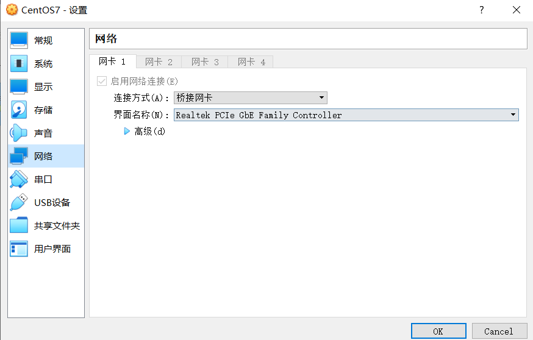
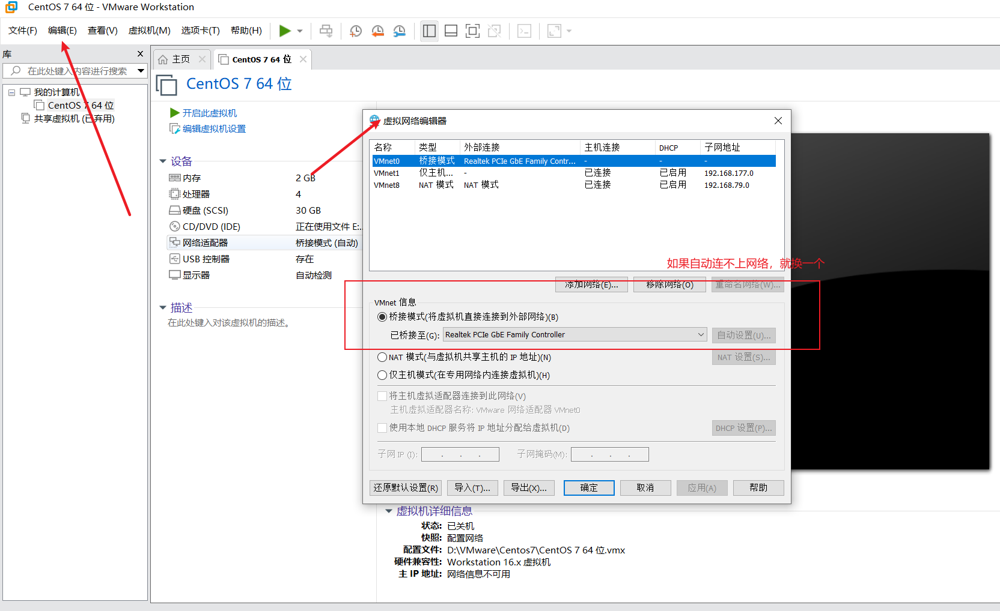
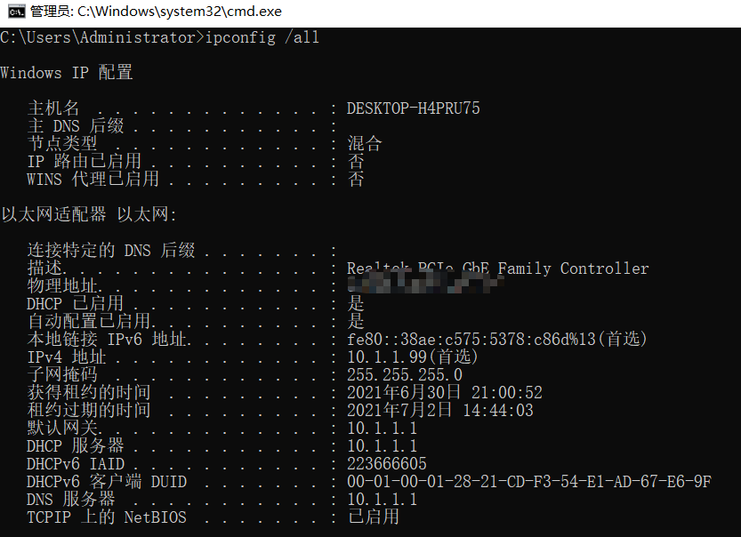
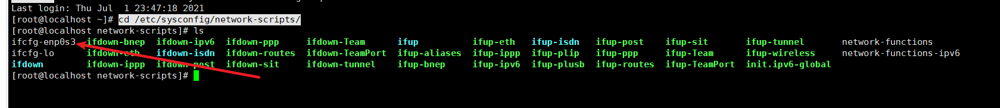
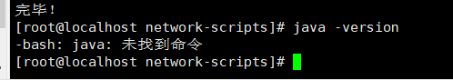
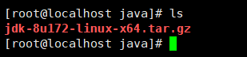
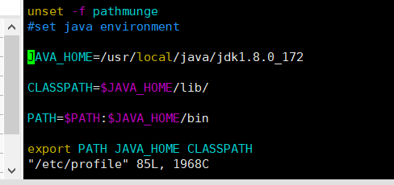
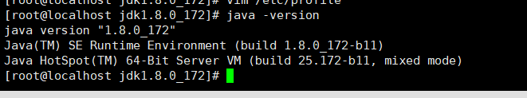
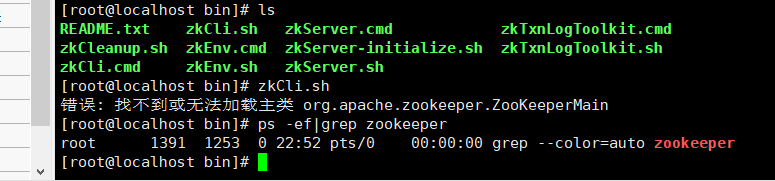
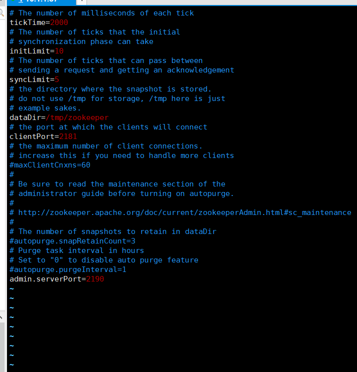

# 一、配置静态IP网络

1、网络连接设置成桥接模式

VirtualBox



VMware 



2、查看主机网络信息

ipconfig /all 



3、配置CentOs 将主机中对应的信息填入对应位置

①：进入 /etc/sysconfig/network-scripts/ 目录

```tex
cd /etc/sysconfig/network-scripts/
```

②：查看下面文件，找到文件，每台电脑的文件名可能不同

```tex
ls
```



③：编辑该文件

```xml
TYPE=Ethernet
PROXY_METHOD=none
BROWSER_ONLY=no
BOOTPROTO=static #修改为静态的
DEFROUTE=yes
IPV4_FAILURE_FATAL=no
IPV6INIT=yes
IPV6_AUTOCONF=yes
IPV6_DEFROUTE=yes
IPV6_FAILURE_FATAL=no
IPV6_ADDR_GEN_MODE=stable-privacy
NAME=enp0s3
UUID=b5d863a6-4ff9-4ce4-8dd7-47f029cef797
DEVICE=enp0s3
ONBOOT=yes #改为yes
IPADDR=10.1.1.87 # 虚拟机的IP，必须和主机同一网段，主机是10.1.1.99，这里就可以改成87
NETMASK=255.255.255.0 # 子网掩码 和主机一致
GATEWAY=10.1.1.1 # 默认网关和主机一致
DNS1=10.1.1.1 # DNS 和主机一致
# IPADDR=10.1.1.87
# NETMASK=255.255.255.0
# GATEWAY=10.1.1.1
# DNS1=10.1.1.1

```

修改完之后按 Esc退出编辑  按  :wq  保存并退出

4、配置网关地址

命令

```xml
vi /etc/sysconfig/network 
```

```xml
# Created by anaconda
NETWORKING=yes
HOSTNAME=Centos # 随便取名
GATEWAY=10.1.1.1 #默认网关和主机一致

```

修改完之后，一样 :wq 保存

5、添加DNS

命令

```xml
vi /etc/resolv.conf
```

```xml
# Generated by NetworkManager
nameserver 10.1.1.1 # 和主机保持一致
```

照例保存

6、重启网络

```tex
service network restart
```

7、测试网络，如果还是不通就切换一下第一步的桥接位置


# 二、CentOS 7 安装JDK

1、查看当前Centos是否安装有JDK

java -version



2、在usr/local目录下面创建java目录

```tex
cd /usr/local/

mkdir java

cd java
```

3、通过工具或者在线获取，将jdk上传到java目录




4、解压文件

```te
tar -zxvf jdk-9.0.4_linux-x64_bin.tar.gz
```

5、更改配置文件

```tex
vim /etc/profile
```

在文件最后添加：

\#set java environment

JAVA_HOME=/usr/local/java/jdk1.8.0_172

CLASSPATH=$JAVA_HOME/lib/

PATH=$PATH:$JAVA_HOME/bin

export PATH JAVA_HOME CLASSPATH



保存并更新更新配置文件

```tex
source /etc/profile
```

6、使用 命令查看版本

```tex
java -version
```




# 三、CentOS 7 安装Zookeeper

1、在 /usr/local 文件夹下，创建 zookeeper 文件夹 并进入目录

```tex
mkdir zookeeper
```

2、通过命令获取Zookeeper 文件（从版本3.5.5开始，带有bin名称的包才是我们想要的下载可以直接使用的里面有编译后的二进制的包，而之前的普通的tar.gz的包里面是只是源码的包无法直接使用。会报错）



```tex
wget https://archive.apache.org/dist/zookeeper/zookeeper-3.5.9/apache-zookeeper-3.5.9.tar.gz(弃用)

wget http://archive.apache.org/dist/zookeeper/zookeeper-3.5.9/apache-zookeeper-3.5.9-bin.tar.gz
```

3、解压文件

```tex
tar -zxvf apache-zookeeper-3.5.9.tar.gz
```

4、更改名称（可不做）

```tex
mv apache-zookeeper-3.5.9 zookeeper-3.5.9
```

5、修改配置文件

```tex
# 进入配置文件目录
cd zookeeper-3.5.9/conf/

# 复制一份配置文件，名为zoo.cfg
cp zoo_sample.cfg zoo.cfg

# 修改配置文件
vim zoo.cfg

# 所有参数默认即可，在最后加上
admin.serverPort=2190
```

Zookeeper有个内嵌的管理控制台，通过netty启动，启动默认端口8080。admin.serverPort=xx，是设置netty启动端口。8080端口很常用，建议更换。也可以通过设置启动参数-Dzookeeper.admin.enableServer=false禁用该功能。



6、设置环境变量（不设置也可以，启动需要在/bin 目录下启动，配置了可以在任意位置启动）

```tex
vim /etc/profile

# 文件末尾添加以下内容
export ZOOKEEPER_HOME=/usr/local/zookeeper/zookeeper-3.5.9 # 修改为自己的安装路径
export PATH=$PATH:$ZOOKEEPER_HOME/bin

# 保存之后，重新加载配置文件
source /etc/profile
```

7、启动

```tex
# 启动（未设置环境变量可以cd到安装目录/bin下面）
zkServer.sh start

# 查看是否启动成功，也可以在安装目录/logs/下查看启动日志
ps -ef|grep zookeeper
```

8、Zookeeper常用命令（没有配置环境变量，进入安装目录/bin 输入）

①：启动服务：zkServer.sh start

②：停止服务：zkServer.sh stop


# 防火墙

systemctl stop firewalld.service      #停止firewall

systemctl disable firewalld.service    #禁止firewall开机启动

systemctl restart firewalld.service   # 重启防火墙

firewall-cmd --state             ##查看防火墙状态，是否是running

man vim(命令名)  查看文档


# 放行端口

```tex
Iptables防火墙

放行6379端口（如果放行其他端口将6379改为需要放行的端口即可）

/sbin/iptables -I INPUT -p tcp --dport 6379 -j ACCEPT

将该设置添加到防火墙的规则中

/etc/rc.d/init.d/iptables save

Firewall防火墙

放行3306端口（要放行其他端口修改3306为需要放行的端口）

firewall-cmd --permanent --zone=public --add-port=3306/tcp;

重新加载配置文件

firewall-cmd --reload
```


# 其他 - 各种命令安装

1、wge

```tex
yum -y install wget
```

2、vim 

```tex
rpm -qa|grep vim

如果出现：

vim-minimal-7.4.160-4.el7.x86_64

就执行命令

yum -y install vim*
```

3、lsof 

```tex
yum install lsof
```


